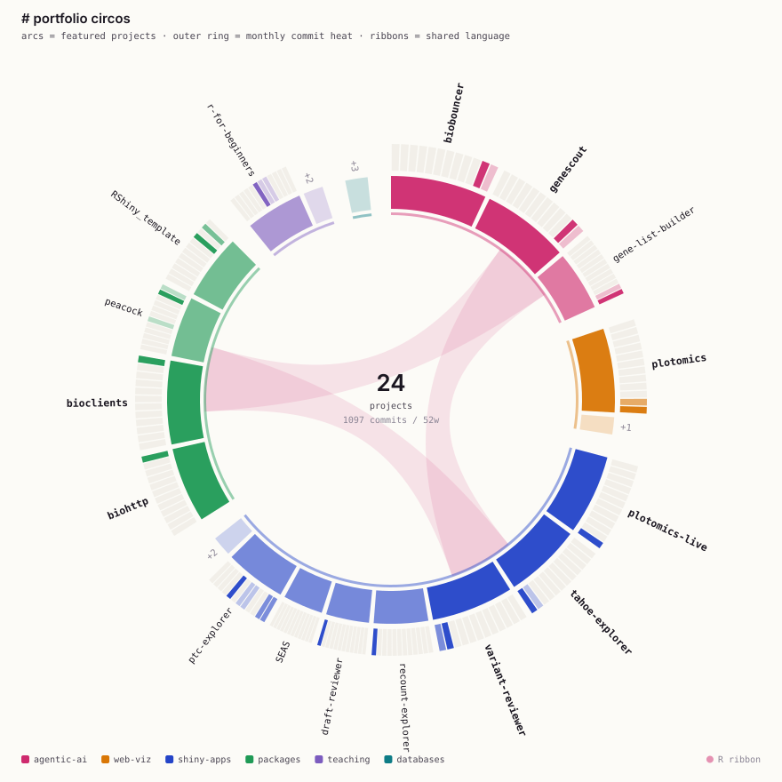

### Hi, I’m Sam 👋

I make omics data easier to explore, trust, and share.

<picture>
  <source media="(prefers-color-scheme: dark)" srcset="assets/viz/circos-dark.svg">
  
</picture>

My portfolio as a circos plot, redrawn nightly from live GitHub data by [my own generator](viz/).

#### Now

- **Software Engineering Intern, Shiny team @ [Posit](https://posit.co/)** (Summer 2026), building Shiny apps for life sciences.
- **Doctoral Researcher in Bioinformatics @ UAB**, working on NF1 and associated cancers.
- Previously: Human Genetics (gRED) intern @ Genentech (Summer 2025).
- 8 peer-reviewed publications in computational biology and genomics ([ORCID](https://orcid.org/0000-0003-4190-7058)).

#### Featured

| Project | What it is |
| --- | --- |
| [plotomics](https://github.com/samuelbharti/plotomics) | GPU-accelerated bioinformatics visualization for R, Python, and the web. Seventeen components, one TypeScript core. |
| [genescout](https://github.com/samuelbharti/genescout) | Turns a candidate gene list and disease context into a ranked, evidence-supported review. Deterministic keyless core, optional Claude agent layer. Built for the [Claude science hackathon](https://www.samuelbharti.com/claude-science-hackathon.html). |
| [biobouncer](https://github.com/samuelbharti/biobouncer) | A gate for biological inputs: validates gene symbols, ontology terms, variant formats, and database identifiers. [Docs](https://www.samuelbharti.com/biobouncer/) |
| [bioclients](https://github.com/samuelbharti/bioclients) + [biohttp](https://github.com/samuelbharti/biohttp) | R clients for 29 biological databases on a normalized HTTP transport with retries, throttling, and circuit breaking. |
| [variant-reviewer](https://github.com/samuelbharti/variant-reviewer) | Shiny app for reviewing a gene or variant across ClinVar, gnomAD, Ensembl, Open Targets, and more. |
| [tahoe-explorer](https://github.com/samuelbharti/tahoe-explorer) | Shiny app for exploring Tahoe-100M single-cell perturbation metadata and building reproducible subsets. |

More on my site: [samuelbharti.com](https://samuelbharti.com)

<b>Toolbox</b>

- **Languages** R · Python · Bash · SQL · JavaScript/TypeScript
- **Apps & viz** Shiny · Quarto · React · Node.js · WebGL · Leaflet
- **Genomics** Seurat · nf-core · bulk/sc/Perturb-seq · WES · ATAC-seq · eQTL/GWAS
- **Agentic AI** Claude API · OpenAI APIs · MCP · LangChain · Google ADK · tool calling
- **Infra** Docker · AWS · GCP · SLURM/HPC · Git

<b>More projects & apps</b>

**R / Shiny**

- [plotomics-live](https://github.com/samuelbharti/plotomics-live): twenty-six biological-data visualizations, each rendered as interactive WebGL and classic ggplot2 side by side.
- [recount-explorer](https://github.com/samuelbharti/recount-explorer): browse, analyze, and export 18,998 recount3 RNA-seq studies.
- [gene-list-builder](https://github.com/samuelbharti/gene-list-builder): ranked multi-source gene lists for a disease, with transparent scoring.
- [draft-reviewer](https://github.com/samuelbharti/draft-reviewer): local Shiny app for reviewing Markdown drafts with paragraph-anchored comments.
- [peacock](https://github.com/samuelbharti/peacock): R package for project initialization and workflow management. [Docs](https://www.samuelbharti.com/peacock/)
- [R Shiny Template](https://github.com/samuelbharti/RShiny_template): reusable template for bioinformatics web apps.
- Install my R packages via [r-universe](https://samuelbharti.r-universe.dev/).

**Genomics apps & analysis**

- **MOLV (Multi-Omics Locus Viewer)**: locus-first Shiny app + R package built at Genentech to explore 11,000+ GWAS, eQTL, pQTL, single-cell, and ATAC-seq datasets in Alzheimer's disease (private).
- **RAPTOR**: agentic system that extracts phenotypes, genes, diseases, and ontology-linked concepts from unstructured patient records (unreleased).
- **scRNA-seq Analysis Integration App**: nf-core outputs + Seurat + pseudobulk + CellChat in one place (in dev).
- [Pediatric Thyroid Cancer Explorer](https://github.com/uab-cgds-worthey/ptc-explorer): interactive WES and bulk RNA exploration.
- [SEAS](https://aimed-lab.shinyapps.io/SEAS/): clinical feature enrichment and prediction. [Docs](https://aimed-lab.github.io/SEAS/)

**Databases & earlier work**

- [PAGER / PAGER Web App](https://github.com/aimed-lab/PAGER-Web-APP): pathway and gene-set enrichment tooling with network views. [Site](http://discovery.informatics.uab.edu/PAGER/)
- [sMAP](https://github.com/BI-STEM-Away/sMAP): transcriptomics QC, stats, and biomarker discovery built for non-coders. [Docs](https://bi-stem-away.github.io/sMAP/)
- [BioDivPortal](https://github.com/samuelbharti/BioDivPortalPoland): biodiversity exploration app for Poland. [App](https://samuelbharti.shinyapps.io/BioDivPortal/)
- [PepEngine](https://pepengine.in/): structural database for synthetic peptides.
- [GlucoKinaseDB](https://glucokinasedb.in/): curated database of glucokinase modulators. [Dataset/API](https://glucokinasedb.in/dataset)
- **VIRdb 2.0**: vitiligo resource.

<b>Teaching & outreach</b>

- Instructor, Carpentry Workshop on [R and Git](https://u-bds.github.io/2026-01-29-uab/) at UAB.
- Instructor, Carpentry Workshop on [Bash Shell, Git, Text Editor, and Python](https://u-bds.github.io/2024-03-18-uab/) at UAB.
- Instructor, Carpentry Workshop on [Bash Shell, Git, Text Editor, and R](https://u-bds.github.io/2023-12-14-uab/) at UAB.
- Helper, Carpentry-style workshop on [Bulk RNA-Seq](https://u-bds.github.io/2024-07-09-uab/) at UAB.
- Flash talk on [R Shiny bioinformatics apps on AWS EC2](https://mentorchains.github.io/STEM-AWAY_AWS_BI_2021/).
- [R For Beginners](https://github.com/samuelbharti/r-for-beginners): interactive lessons and Quarto slides for workshops and self-paced learning.

---

[Portfolio](https://samuelbharti.com) · [LinkedIn](https://www.linkedin.com/in/samuelbharti/) · [ORCID](https://orcid.org/0000-0003-4190-7058) · [Email](mailto:samuelbharti.io@gmail.com)
